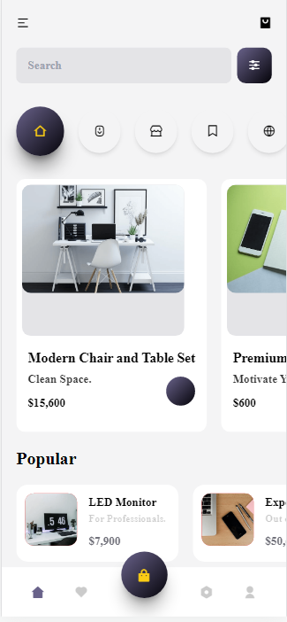

# online-shopping-app

This is repository contains a simple beginner-level project in which I (@student-PiyushMishra) tried to make a simple web app using HTML, CSS and JS which is an online shopping platform (hypothetical). The project focus to enhnace one's basic javascript knowledge as the data shown on the webpage is rendered by JavaScript just like React.js. The webapp is fully responsive and optimised to work on a variety of devices.

<h3>This website is under development and varies of the features will come soon in this project such the cart option, search functionality and some other amazing stuffs like that!</h3>

<a href="https://student-piyushmishra.github.io/js-shopping-app/">View Live Sample</a>

